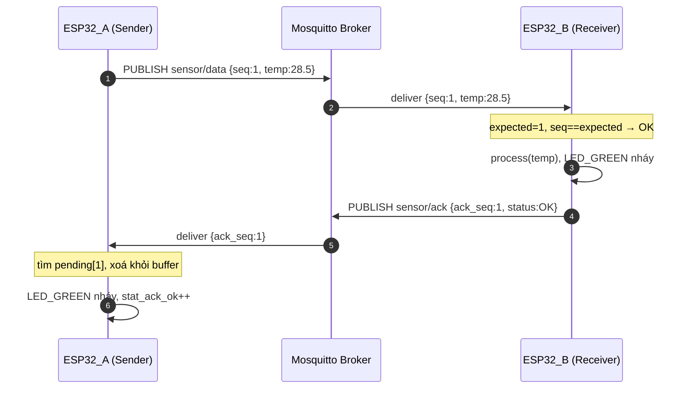
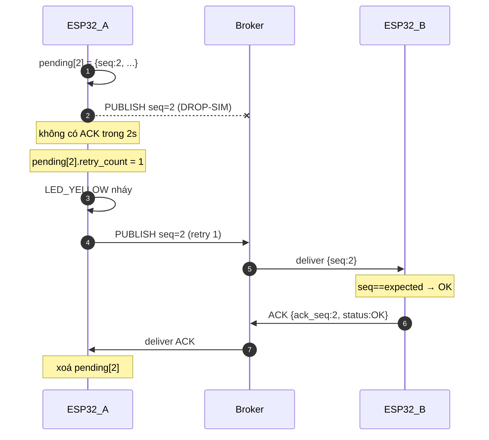
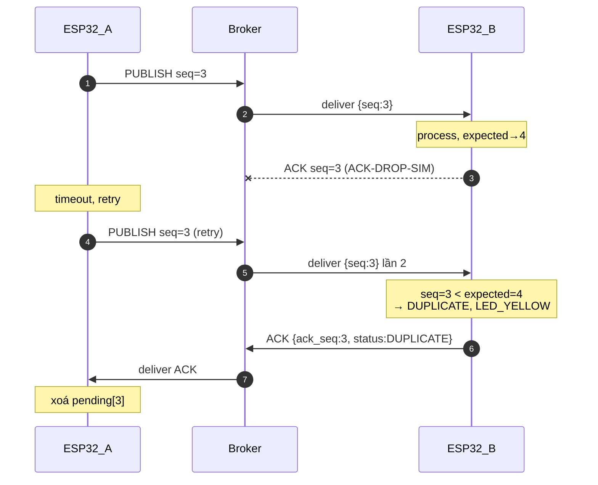
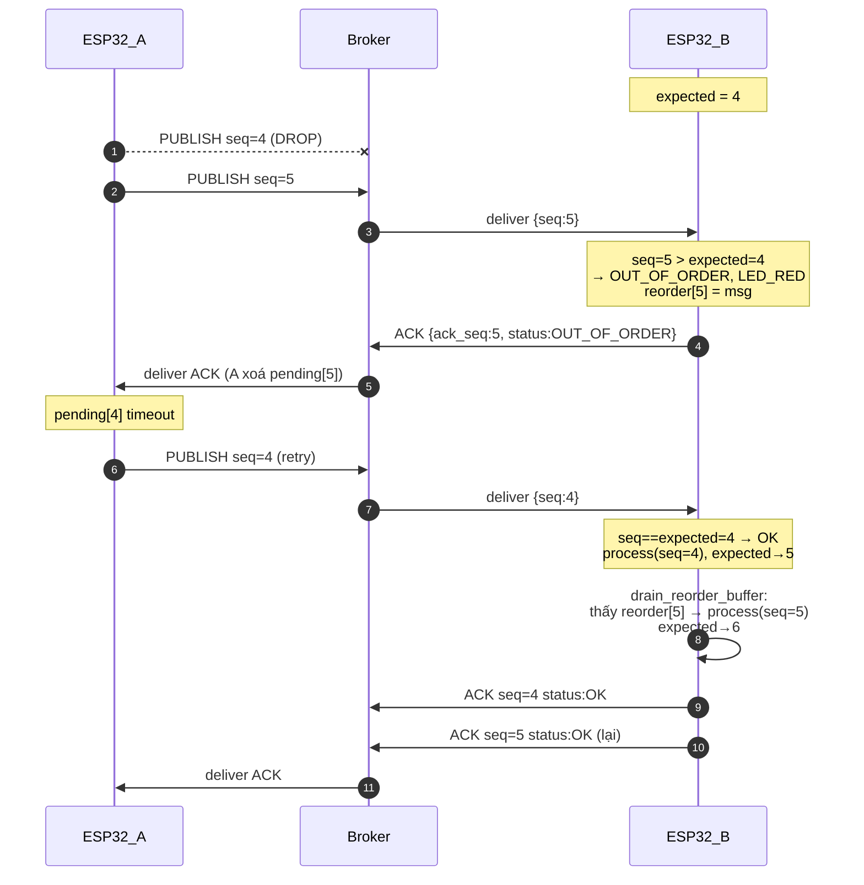
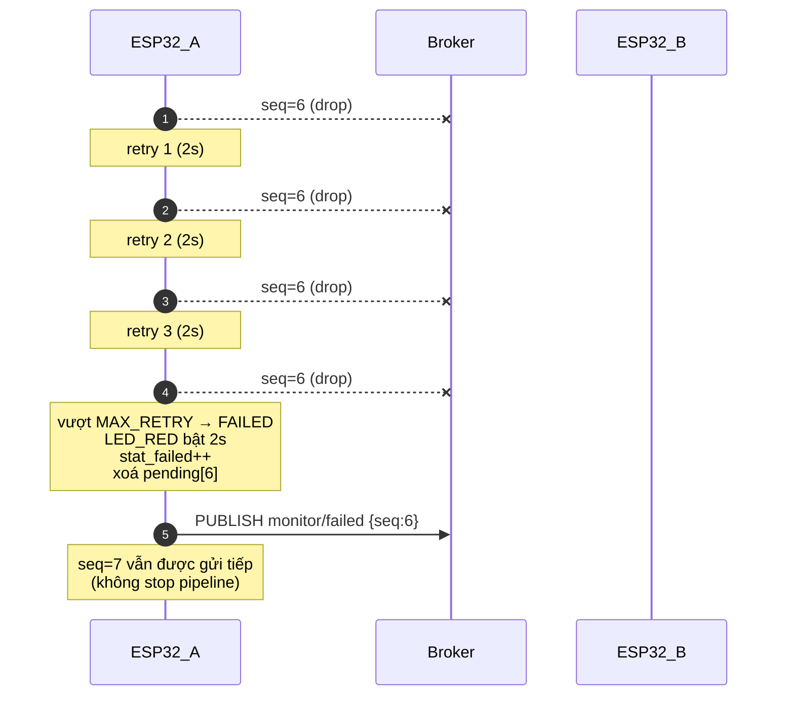
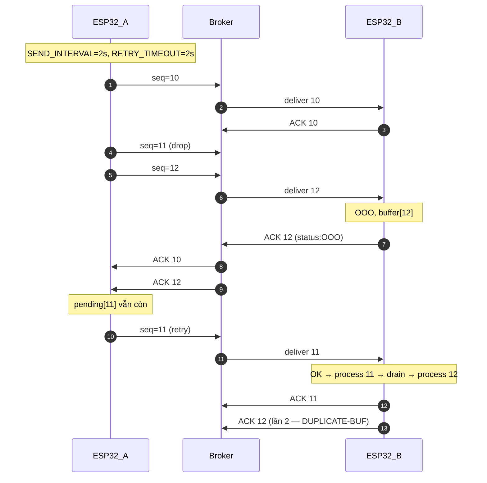
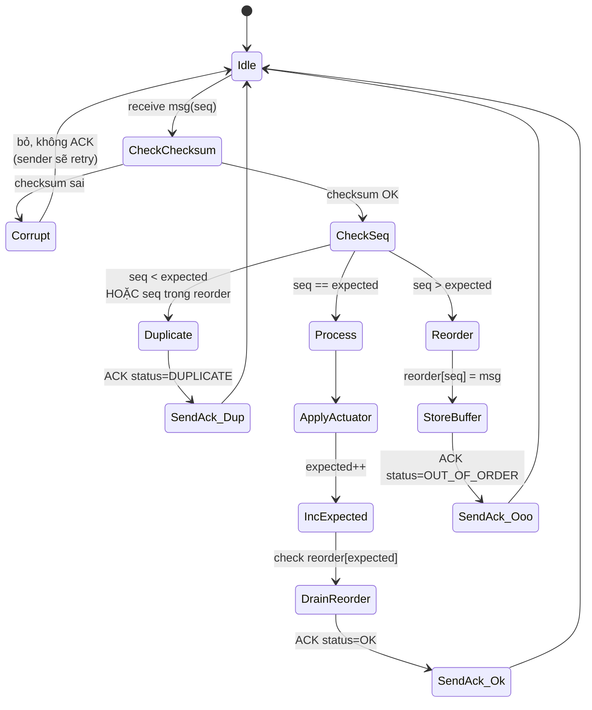
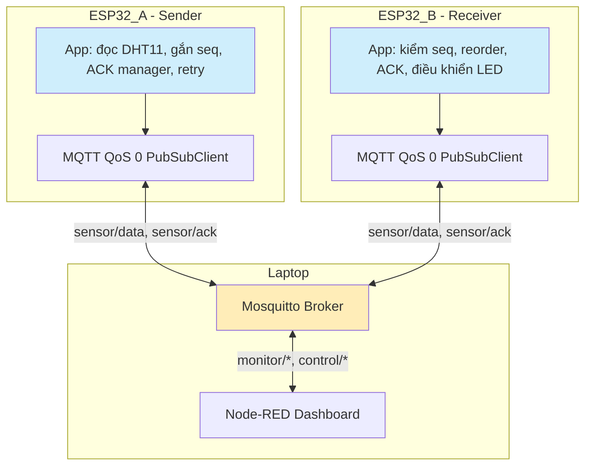
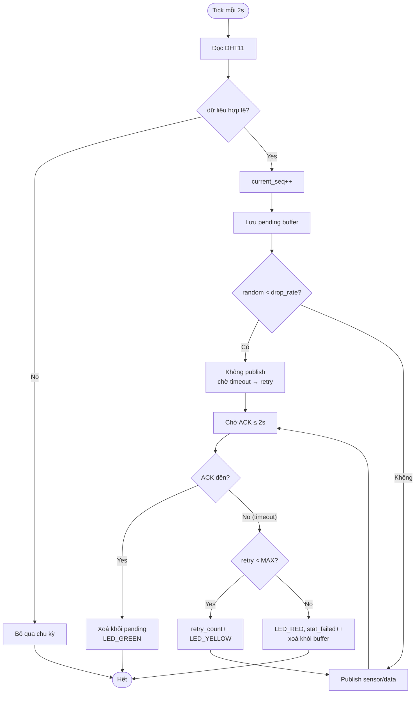

# Sequence Diagrams (cho báo cáo & slide thuyết trình)

> Tất cả diagram được viết bằng **Mermaid syntax**. Có thể render trực tiếp bằng VS Code, GitHub, hoặc tại https://mermaid.live.

## 1. Kịch bản 1 — Truyền bình thường (no loss)

## 2. Kịch bản 2 — Mất data → retry thành công

## 3. Kịch bản 3 — Mất ACK → Duplicate detection

## 4. Kịch bản 4 — Out-of-order với reorder buffer

## 5. Kịch bản 5 — Fail sau MAX_RETRY

## 6. Kịch bản 6 — Sliding flow nhiều message song song

## 7. State diagram bên Receiver (ESP32_B)

## 8. Diagram tổng quan tầng giao thức trong đồ án

## 9. Activity diagram — vòng đời 1 message

